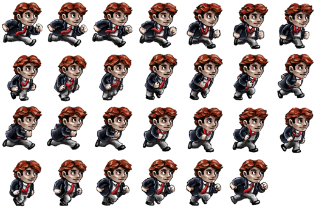
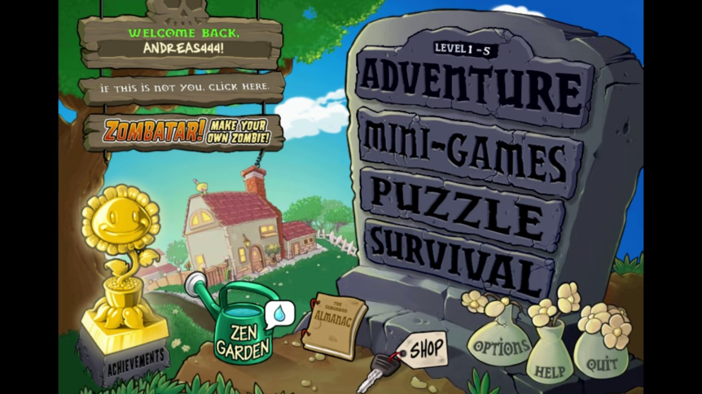
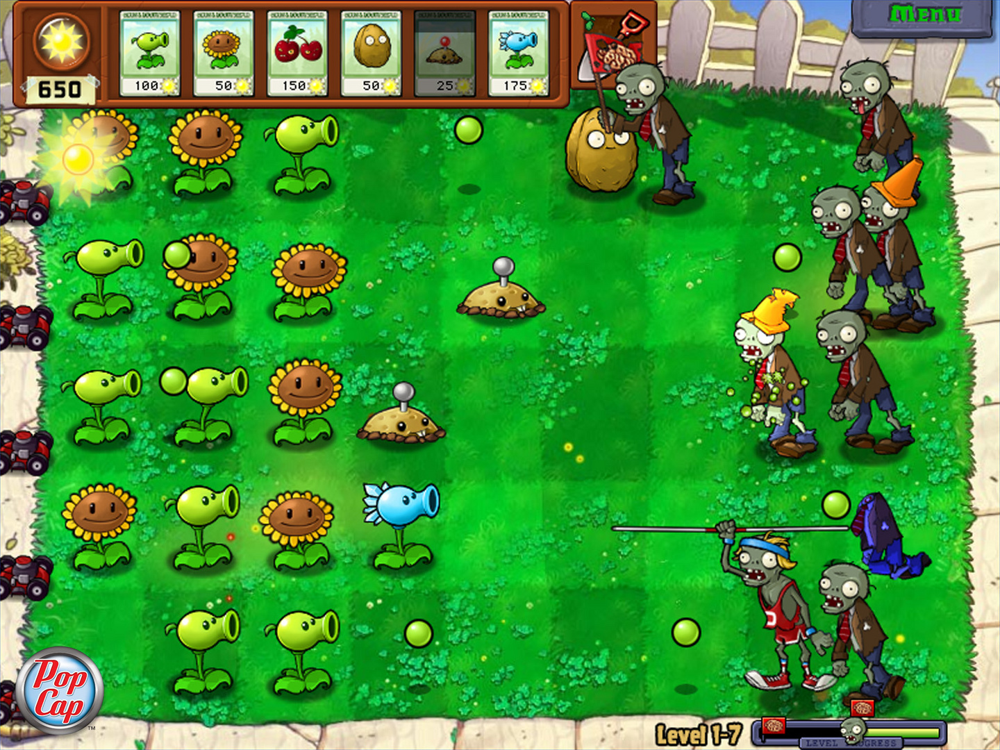
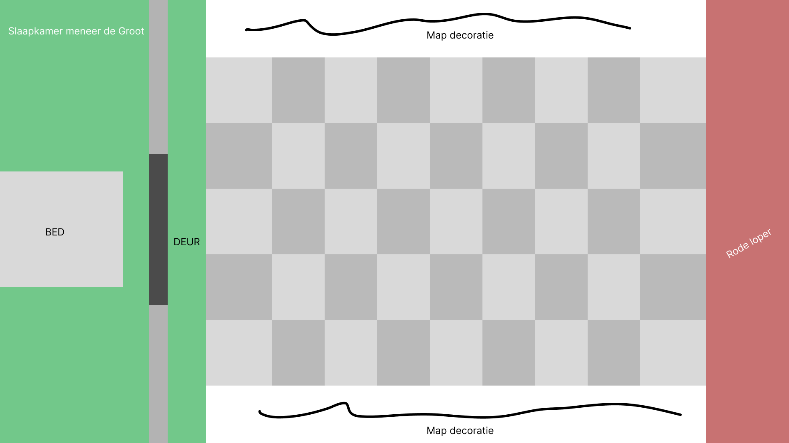

# Voorbeelden

###### Voorbeeld A - animatie

---

# Algemeen

- 4 verschillende cursors (uiterlijk van de muis)
    - normaal (altijd zichtbaar)
    - verwijderen (wanneer je iets wilt verwijderen) (bijv. een kruis)
    - plaatsen (wanneer je een defender selecteert en die wilt plaatsen)
    - grijpen (wanneer je iets vasthoudt en verplaatst)

# Schermen

## Main menu

###### Voorbeeld Main Menu

> Zorg ervoor dat de start knop als een los bestand geleverd wordt met een voorbeeld van waar die geplaatst moet worden,
> zo kan ik die klikbaar maken en klein beetje animeren.

#### Verlangde assets

- Achtergrond
    - Start knop, wellicht met eigen handschrift, natuurlijk een beetje een griezelige stijl bijv. met druipend bloed
    - settings knop (bijv. tandwiel of moersleutel)

# Map

###### Voorbeeld origineel (zonder weg)

###### Voorbeeld B - map inc. hud

### Stijl & Thema

- Spookhuis
- Slechte houten vloeren
- Huis van meneer de Groot

### Overzicht / layout (op schaal in pixels)

### Verlangde assets

- meneer de groot
    - Zorg ervoor dat hij links in beeld past en minder dan 1/3 van het scherm in beslag neemt
    - Ziet er niet blij uit en is in zijn pyjama's
- 2 vloervakken / tiles, voor een om-en-om structuur voor duidelijke grid onderscheiding tussen tiles.
- Volledige achtergrond
- Achtergrond voor overlay/hud (links boven voorbeeld B)
    - Plek voor druppel-teller en getal eronder
    - Met daarnaast 5 plekken voor een kaart waarin de plaatsbare karakters zullen staan
        - Karakters erin verwerken
        - En prijs erin verwerken
            - Waterpistool > 100 druppels
            - wolk > 50 druppels
            - Gebroken vloer, water val > 25 druppels
            - spiegel > 200 druppels

# Game
